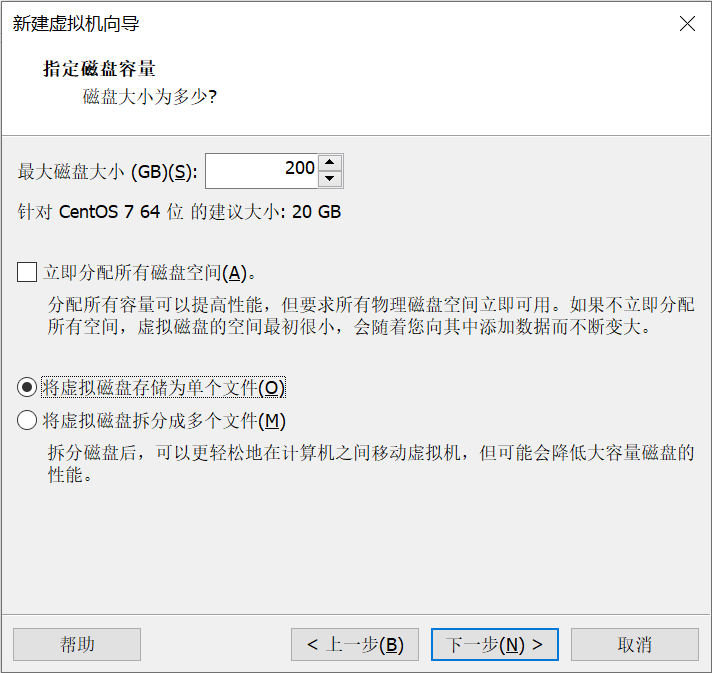

# 附录1：虚拟机创建和系统安装

本教程采用的是VM Station软件

1. 创建虚拟机

2.创建完虚拟机后，点击“虚拟机设置”进行修改。

首先，点击处理器，勾选虚拟化。

然后，点击“CD/DVD”，选择iso系统安装文件所谓位置，本教程采用的是Centos7.9 Minimal版本。

最后，点击“添加”，增加一个网络适配器。最终配置如下：

3. 安装系统。开启虚拟机，选择语言。

然后，点击“安装位置”进行磁盘分区。

选择下面的“我要配置分区”，然后点击“完成”。

点击“自动创建”，再点完成。

点击“接受更改”，然后返回到主界面点击“继续安装”。

点击root密码进行设置。

之后，等待系统安装完成重启虚拟机即可。
