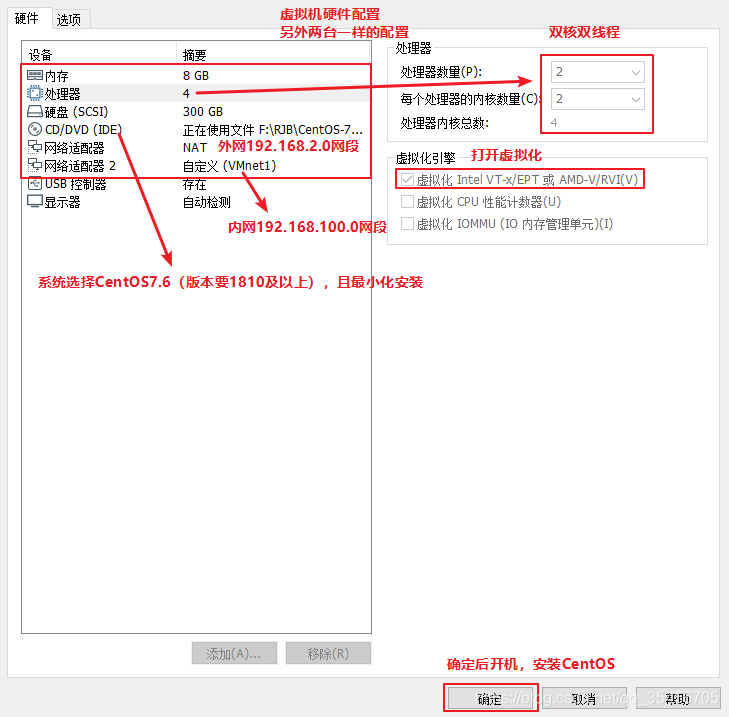
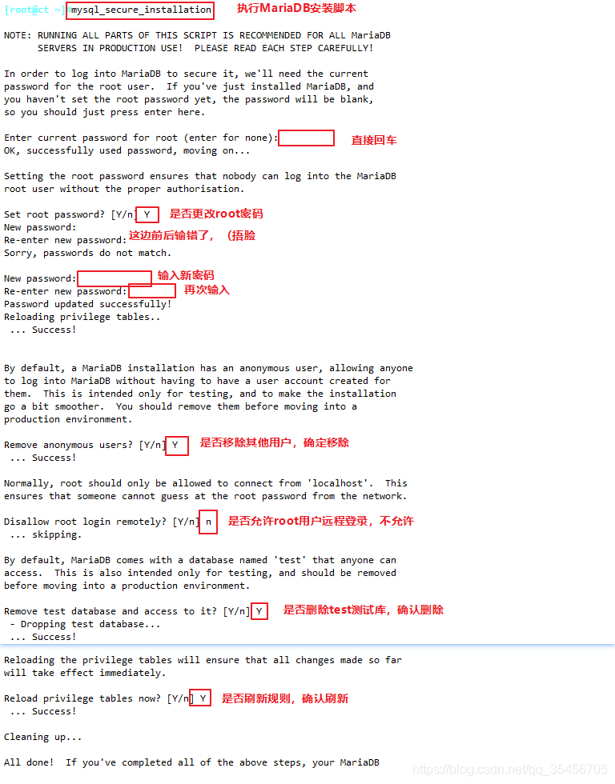

官方文档：https://docs.openstack.org/zed/install/
参考链接：
1. trian：https://blog.csdn.net/qq_35456705/article/details/114962435
2. yugo：https://computingforgeeks.com/install-and-configure-openstack-on-centos/

### 1. 创建虚拟机和安装系统
创建三台虚拟机，配置如下



系统选择：
Centos Linux 8 完全不支持，除非升级到Centos Stream 8
Centos Linux 7 可以持续，但2024年6月30日也会停止维护。

Ubuntu

安装成功后，修改主机名并关闭防火墙

```
systemctl stop firewalld 
systemctl disable firewalld 
setenforce 0 #永久关闭 
vi /etc/sysconfig/selinux 
SELINUX=disabled #重启后生效
```

```
hostnamectl set-hostname controller
su
```


### 2. 网络设置
外网：eth0 内网 eth1
控制节点：192.168.100.10（外网）192.168.200.10（内网）
计算节点1：192.168.100.20（外网）192.168.200.20（内网）
计算节点2：192.168.100.30（外网） 192.168.200.30（内网）
网关 192.168.100.2

在Install CentOS 7界面点击Tab键，在下方输入这两段配置字段  
net.ifnames=0 biosdevname=0 (创建时可修改为从eth0开始的网卡）

修改第一块网卡
```
cd /etc/sysconfig/network-scripts/
ls
vi ifcfg-eth0

BOOTPROTO=static			#修改网卡配置参数，修改为静态IP
IPV4_ROUTE_METRIC=90		#设置网卡优先级，默认100，越低优先级越高，防止出现两张网卡为了抢占优先级导致无法连接问题

ONBOOT=yes					#开启设备开机启动
IPADDR=192.168.2.10  		#添加字段，静态模式IP自定义
NETMASK=255.255.255.0		#添加字段，设置子网掩码
GATEWAY=192.168.2.2		#添加字段，设置网关
#DNS1=192.168.2.2   #选择添加字段，设置域名服务器，有些需要配置dns服务器，否则无法使用yum

systemctl restart NetworkManager #Centos8
systemctl restart network #Centos7
ip a
```


修改第二块网卡
```
vim /etc/sysconfig/network-scripts/ifcfg-eth1
BOOTPROTO=static
IPV4_ROUTE_METRIC=100  #默认值为100，这里为了保险可以设置一下
ONBOOT=yes
IPADDR=192.168.100.10
NETMASK=255.255.255.0

systemctl restart NetworkManager #Centos8
systemctl restart network #Centos7
ip a
```

配置host映射，映射地址为局域网ip
控制节点：
```
echo '192.168.200.10 controller' >> /etc/hosts 
echo '192.168.200.20 compute1' >> /etc/hosts 
echo '192.168.200.30 compute2' >> /etc/hosts 
cat /etc/hosts
```

计算节点：

```
echo '192.168.200.10 controller' >> /etc/hosts 
cat /etc/hosts
```


三台节点做免交互  
非对称密钥
```
ssh-keygen -t rsa #全部回车默认
ssh-copy-id controller 
ssh-copy-id compute1
ssh-copy-id compute2
```


安装依赖包

如果Centos8 那么要先更新yum为国内源
```
cd /etc/yum.repos.d/
mkdir backup && mv CentOS-Linux-*.repo backup
curl -o /etc/yum.repos.d/CentOS-Linux-Base-ali.repo http://mirrors.aliyun.com/repo/Centos-8.repo
yum -y install wget
```

配置epel源：
```
yum install -y epel-release

vi /etc/yum.repos.d/epel.repo

baseurl=https://mirrors.aliyun.com/epel/$releasever/Everything/$basearch
#metalink=https://mirrors.fedoraproject.org/metalink?repo=epel-$releasever&arch=$basearch&infra=$infra&content=$contentdir

dnf repolist epel -v
```

然后执行以下命令
```
yum -y install \ net-tools \ bash-completion \ vim \ gcc gcc-c++ \ make \ pcre pcre-devel \ expat-devel \ cmake \ bzip2 \ lrzsz
```


### 2. 时间同步+周期性计划任务

官方文档：https://docs.openstack.org/install-guide/environment-ntp.html
**注意：  
ct ->同步阿里云时钟服务器  
c1、c2 -> 同步controller

```
vi /etc/resolv.conf
nameserver 114.114.114.114

yum install chrony -y
```

控制节点：
```
vim /etc/chrony.conf
server 0.centos.pool.ntp.org iburst   #注释掉
server 1.centos.pool.ntp.org iburst   #注释掉
server 2.centos.pool.ntp.org iburst	  #注释掉
server 3.centos.pool.ntp.org iburst	  #注释掉
server ntp6.aliyun.com iburst         #配置阿里云时钟服务器源  
allow 192.168.200.0/24     #允许192.168.100.0/24网段的主机来同步时钟服务

systemctl enable chronyd
systemctl restart chronyd

#使用 chronyc sources 时间同步
chronyc sources
```

计算节点：
```
vim /etc/chrony.conf 
server 0.centos.pool.ntp.org iburst	  #注释掉
server 1.centos.pool.ntp.org iburst	  #注释掉
server 2.centos.pool.ntp.org iburst   #注释掉
server 3.centos.pool.ntp.org iburst   #注释掉
server controller iburst			          #配置阿里云时钟服务器源，同步指向控制节点ct

systemctl enable chronyd.service
systemctl restart chronyd.service

chronyc sources
```

配置计划任务
```
#配置计划任务，每隔2分钟同步一次 
crontab -e */2 * * * * /usr/bin/chronyc sources >>/var/log/chronyc.log 
#查看设置的周期性任务 
crontab -l
```
### SQL数据库

官方文档：https://docs.openstack.org/install-guide/environment-sql-database-rdo.html

```
yum -y install mariadb mariadb-server python2-PyMySQL libibverbs

#---------模块解释---------------------------------
mariadb：是mysql的一个分支，是一款完全兼容mysql的开源软件
mariadb-server：数据库服务
python2-PyMySQL：用于openstack的控制端连接mysql所需要的模块，如果不安装，则无法连接数据库；此包只安装在控制端
libibverbs：远程直接内存访问

```


```
vim /etc/my.cnf.d/openstack.cnf
[mysqld]
bind-address = 192.168.100.10
default-storage-engine = innodb
innodb_file_per_table = on
max_connections = 4096
collation-server = utf8_general_ci
character-set-server = utf8

#---------配置解释---------------------------------------------
bind-address = 192.168.100.10			#控制节点局域网地址
default-storage-engine = innodb 		#默认存储引擎 
innodb_file_per_table = on 				#每张表独立表空间文件
max_connections = 4096 				    #最大连接数 
collation-server = utf8_general_ci 		#服务器校对时不区分大小写
character-set-server = utf8             #默认字符集 
#---------------------------------------------------------------

systemctl enable mariadb
systemctl start mariadb

```

 ```
 mysql_secure_installation
```



### 消息队列

官方文档：https://docs.openstack.org/install-guide/environment-messaging-rdo.html

官方采用的是Rabbitmq，但是centos8 安装有一堆坑。。。

```
yum -y install rabbitmq-server
systemctl enable rabbitmq-server.service
systemctl start rabbitmq-server.service
```

```
1）创建消息队列用户,用于controler和 计算节点连接rabbitmq的认证（关联）
rabbitmqctl add_user openstack RABBIT_PASS
#-----------输出内容-------------
Creating user "openstack"
#----------------------------------

2）配置openstack用户的操作权限(正则，配置读写权限
rabbitmqctl set_permissions openstack ".*" ".*" ".*"
#------------输出内容---------------------------------------
Setting permissions for user "openstack" in vhost "/"

#可查看25672和5672 两个端口（5672是Rabbitmq默认端口，25672是Rabbit的测试工具CLI的端口）
netstat -natp | grep 5672

3）查看rabbitmq插件列表
rabbitmq-plugins list

4）开启rabbitmq的web管理界面的插件，端口为15672
rabbitmq-plugins enable rabbitmq_management

5）检查端口（25672 5672 15672）
ss -natp | grep 5672

```
### MEMCACHED

安装memcached是用于存储session信息；服务身份验证机制（keystone）使用Memcached来缓存令牌 在登录openstack的dashboard时，会产生一些session信息，这些session信息会存放到memcached中
```
**For CentOS 7 and RHEL 7**
yum install memcached python-memcached

**For CentOS 8 and RHEL 8**
yum install memcached python3-memcached

#python-*模块在OpenStack中起到连接数据库的作用


vim /etc/sysconfig/memcached
PORT="11211"                      #memcached端口11211
USER="memcached"                  #用户memcached
MAXCONN="1024"                    #最大连接数1024
CACHESIZE="64"                    #字符集大小64位
OPTIONS="-l 127.0.0.1,::1,ct"     #监听地址，127.0.0.1：本地地址，::是ipv6地址，ct是本地VMnet1地址

systemctl enable memcached
systemctl start memcached
netstat -nautp | grep 11211

```

### Etcd

yum安装失败，参考以下链接：https://computingforgeeks.com/how-to-install-etcd-on-rhel-centos-rocky-almalinux/#google_vignette
```
安装etcd
yum -y install etcd

修改其配置文件
vim /etc/etcd/etcd.conf 
ETCD_DATA_DIR="/var/lib/etcd/default.etcd"
ETCD_LISTEN_PEER_URLS="http://192.168.100.10:2380"
ETCD_LISTEN_CLIENT_URLS="http://192.168.100.10:2379"
ETCD_NAME="ct"
ETCD_INITIAL_ADVERTISE_PEER_URLS="http://192.168.100.10:2380"
ETCD_ADVERTISE_CLIENT_URLS="http://192.168.100.10:2379"
ETCD_INITIAL_CLUSTER="ct=http://192.168.100.10:2380"
ETCD_INITIAL_CLUSTER_TOKEN="etcd-cluster-01"
ETCD_INITIAL_CLUSTER_STATE="new"
#-------------------配置解释---------------------------------------
ETCD_DATA_DIR="/var/lib/etcd/default.etcd"  #数据目录位置
ETCD_LISTEN_PEER_URLS="http://192.168.100.10:2380" #监听其他etcd member的url（2380端口，集群之间通讯，域名为无效值）
ETCD_LISTEN_CLIENT_URLS="http://192.168.100.10:2379" #对外提供服务的地址（2379端口，集群内部的通讯端口）
ETCD_NAME="ct" #集群中节点标识（名称）
ETCD_INITIAL_ADVERTISE_PEER_URLS="http://192.168.100.10:2380" #该节点成员的URL地址，2380端口：用于集群之间通讯。
ETCD_ADVERTISE_CLIENT_URLS="http://192.168.100.10:2379"
ETCD_INITIAL_CLUSTER="ct=http://192.168.100.10:2380"	
ETCD_INITIAL_CLUSTER_TOKEN="etcd-cluster-01"	#集群唯一标识
ETCD_INITIAL_CLUSTER_STATE="new"  #初始集群状态，new为静态，若为existing，则表示此ETCD服务将尝试加入已有的集群若为DNS，则表示此集群将作为被加入的对象
#-----------------------------------------------------------------------

systemctl enable etcd.service
systemctl start etcd.service
netstat -anutp |grep 2379
netstat -anutp |grep 2380
```


